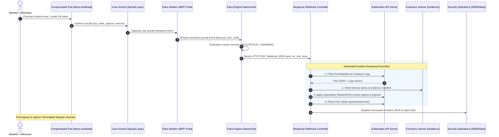

# Kubernetes Runtime Security & Cloud-Native Incident Response Platform

[](https://github.com/ravishkarathnayaka/Kubernetes-Runtime-Security-Cloud-Native-Incident-Response-Platform./actions/workflows/ci.yml)
[](https://github.com/ravishkarathnayaka/Kubernetes-Runtime-Security-Cloud-Native-Incident-Response-Platform./actions/workflows/security-scan.yml)
[](https://kubernetes-runtime-security-cloud-n.vercel.app)
[](https://opensource.org/licenses/MIT)
[](https://kubernetes.io/)
[](https://falco.org/)
[](https://python.org/)

> **An enterprise-grade, cloud-native runtime security detection and automated incident response platform.**  
> Built for Kubernetes environments, leveraging **Falco with modern eBPF probes** for behavioral kernel-level telemetry, an asynchronous **Python FastAPI response controller** for dynamic pod quarantine via **Kubernetes NetworkPolicies**, automated digital forensic snapshotting, and **CIS Kubernetes Benchmark** compliance auditing via **kube-bench**. The entire environment runs locally for **$0** on a multi-node **Kind** cluster.

---

## Table of Contents

- [Architectural Overview](#architectural-overview)
- [Detection-to-Containment Pipeline (Mermaid Diagram)](#detection-to-containment-pipeline)
- [MITRE ATT&CK for Containers Matrix Mapping](#mitre-attck-for-containers-matrix-mapping)
- [Repository Layout](#repository-layout)
- [Prerequisites & Zero-Cost Kind Setup](#prerequisites--zero-cost-kind-setup)
- [Step-by-Step Lab Setup & Deployment](#step-by-step-lab-setup--deployment)
- [Simulated Attack Scenarios & Automated Containment](#simulated-attack-scenarios--automated-containment)
- [Sample Terminal Evidence: Before vs. After Quarantine](#sample-terminal-evidence-before-vs-after-quarantine)
- [Interactive Web Portal & Vercel Deployment](#interactive-web-portal--vercel-deployment)
- [CIS Kubernetes Benchmark Auditing](#cis-kubernetes-benchmark-auditing)
- [Automated Testing & CI/CD Validation](#automated-testing--cicd-validation)
- [Production Hardening Guidelines](#production-hardening-guidelines)
- [License](#license)

---

## Architectural Overview

Static container security (image vulnerability scanning, admission control, and linting) is essential, but cannot detect active zero-day exploitation, memory-only living-off-the-land attacks, service account token harvesting, or unauthorized lateral movement during runtime.

This platform bridges the runtime detection and containment gap:

1. **Kernel Telemetry via Modern eBPF**: Falco operates as a DaemonSet across control-plane and worker nodes. Utilizing the modern eBPF driver, Falco hooks kernel tracepoints (`sys_enter_execve`, `sys_enter_openat`, `sys_enter_connect`) without requiring third-party kernel modules or custom kernel headers.
2. **Deterministic Threat Rules**: Custom Falco detection rules detect interactive shell spawning, credential access targeting service account tokens, host filesystem escapes, and unexpected egress C2 connections.
3. **Real-Time Automated Containment Controller**: A lightweight FastAPI microservice listens for Falco alert webhooks. Upon receiving high-severity events (`CRITICAL`, `WARNING`), the controller initiates a four-step automated play:
   - **Forensic Acquisition**: Extracts container stdout/stderr logs and serializes the live pod spec and cluster runtime status before any changes occur.
   - **Network Quarantine**: Instantly synthesizes and applies a targeted Kubernetes `NetworkPolicy` (`quarantine-<pod-name>`) that drops all ingress and egress packets for that pod selector.
   - **Pod Metadata Tagging**: Labels the pod with `security.incident/quarantined="true"` and records forensic annotations for monitoring and SIEM ingestion.
   - **Structured Alert Dispatch**: Logs the structured incident payload to stdout and optionally triggers notifications to Slack or SIEM webhooks.
4. **Zero-Trust Network Microsegmentation**: Enforced using Project Calico CNI on Kind, applying baseline default-deny and DNS whitelisting policies.

---

## Detection-to-Containment Pipeline



---

## MITRE ATT&CK for Containers Matrix Mapping

| MITRE ATT&CK Tactic | Technique ID | Technique Name | Falco Rule | Severity | Automated Response Action |
| :--- | :--- | :--- | :--- | :--- | :--- |
| **Execution** | [T1059.004](https://attack.mitre.org/techniques/T1059/004/) | Interactive Shell in Container | `k8s_exec_terminal.yaml` | `WARNING` | Log snapshot, NetworkPolicy quarantine, tag pod metadata |
| **Credential Access** | [T1552.007](https://attack.mitre.org/techniques/T1552/007/) | Container & Resource Discovery: Token Theft | `k8s_token_access.yaml` | `CRITICAL` | Total ingress/egress severance, container logs dump, SIEM dispatch |
| **Privilege Escalation** | [T1611](https://attack.mitre.org/techniques/T1611/) | Escape to Host via Mount / Namespace | `k8s_container_escape.yaml` | `CRITICAL` | Instant network quarantine, forensic pod manifest dump |
| **Command & Control** | [T1071](https://attack.mitre.org/techniques/T1071/) | Application Layer Protocol / Egress C2 | `k8s_outbound_c2.yaml` | `WARNING` | Quarantine NetworkPolicy applied, outbound connection blocked |
| **Defense Evasion** | [T1562](https://attack.mitre.org/techniques/T1562/) | Impair Defenses | `default-deny-all.yaml` | `BASELINE` | Microsegmentation prevents lateral movement across namespaces |

---

## Repository Layout

```text
├── .github/
│   └── workflows/
│       ├── ci.yml                     # Runs pytest, coverage, kubeconform manifest validation, & rule tests
│       └── security-scan.yml          # Scans repository with Aqua Trivy and Gitleaks
├── cluster/
│   ├── kind-config.yaml               # 3-node Kind cluster spec (1 control-plane, 2 workers) with eBPF mounts
│   ├── setup_cluster.sh               # Master bootstrap script (Kind + Calico CNI + Falco + Controller)
│   └── manifests/
│       └── controller-deployment.yaml # K8s Deployment, RBAC, ServiceAccount, and Service for Controller
├── falco/
│   ├── falco-values.yaml              # Helm values configuring modern eBPF driver and webhook output
│   └── rules/
│       ├── k8s_exec_terminal.yaml     # Detects interactive bash/sh/ash spawned inside pod
│       ├── k8s_token_access.yaml      # Detects unauthorized access to serviceaccount tokens
│       ├── k8s_container_escape.yaml  # Detects host mounts, nsenter, /proc/sysrq-trigger tampering
│       └── k8s_outbound_c2.yaml       # Detects suspicious outbound traffic to non-whitelisted ports
├── response_controller/
│   ├── __init__.py
│   ├── app.py                         # FastAPI webhook engine receiving and validating Falco alerts
│   ├── k8s_client.py                  # Kubernetes Python SDK wrapper (pod operations, network policies)
│   ├── requirements.txt               # Controller Python dependencies
│   ├── Dockerfile                     # Multi-stage, unprivileged non-root container image
│   └── actions/
│       ├── __init__.py
│       ├── isolate_pod.py             # Generates dynamic zero-traffic NetworkPolicy (quarantine-<pod>)
│       ├── label_pod.py               # Patches labels (quarantined=true) and incident annotations
│       ├── snapshot_evidence.py       # Captures pod YAML spec, status, and container stdout/stderr logs
│       └── alert_dispatcher.py        # Emits structured JSON summary to stdout and Slack webhook
├── network_policies/
│   ├── default-deny-all.yaml          # Zero-trust baseline denying all ingress and egress
│   ├── allow-dns-internal.yaml        # Whitelists egress to internal CoreDNS (port 53 UDP/TCP)
│   └── quarantine-template.yaml       # Standalone quarantine policy template for pod isolation
├── benchmark/
│   └── run_kube_bench.sh              # Audits control-plane & worker nodes against CIS K8s Benchmark
├── simulations/
│   ├── attack_interactive_shell.sh   # Spawns pod and simulates interactive /bin/sh execution
│   ├── attack_token_harvest.sh        # Simulates unauthorized read of serviceaccount token
│   └── run_all_simulations.sh         # Master validation harness: tests pre vs. post quarantine traffic
├── tests/
│   ├── test_controller_actions.py     # 18 unit tests mocking CoreV1Api & NetworkingV1Api (100% offline)
│   └── test_falco_rule_syntax.py      # Schema and syntax validator for custom Falco YAML rules
├── web/
│   └── index.html                     # Interactive Cyber-SOC showcase portal for Vercel deployment
├── vercel.json                        # Vercel deployment configuration
└── README.md                          # Comprehensive architecture, reproduction, and test documentation
```

---

## Prerequisites & Zero-Cost Kind Setup

The entire lab runs on your local workstation without requiring public cloud accounts or paid software:

| Tool | Minimum Version | Purpose |
| :--- | :--- | :--- |
| **Docker** | `20.10+` | Container runtime engine |
| **Kind** | `v0.22+` | Local multi-node Kubernetes cluster in Docker |
| **kubectl** | `v1.28+` | Kubernetes cluster CLI |
| **Helm** | `v3.12+` | Kubernetes package manager for Falco deployment |
| **Python** | `3.10+` | Local controller testing and pytest harness |

---

## Step-by-Step Lab Setup & Deployment

### 1. Provision the Multi-Node Cluster and Security Stack
Run the automated bootstrap script:
```bash
chmod +x cluster/setup_cluster.sh
./cluster/setup_cluster.sh
```

**What the script executes:**
1. Provisions a 3-node Kind cluster (`security-lab`) with 1 control-plane and 2 worker nodes, pre-configured with `/sys/kernel/debug` and `/sys/fs/bpf` volume mounts.
2. Disables default `kindnet` and installs **Project Calico CNI**, providing real kernel packet filtering for `NetworkPolicies`.
3. Builds the `falco-response-controller` container image locally and loads it directly into the Kind cluster nodes.
4. Deploys the controller into namespace `falco-response` with least-privilege RBAC permissions.
5. Deploys **Falco** via official Helm charts using the `modern_ebpf` driver and mounts custom behavioral rules from `falco/rules/`.
6. Configures Falco HTTP output to forward events directly to `http://falco-response-controller.falco-response.svc.cluster.local:8080/webhook`.

### 2. Verify Cluster Health & Pods
```bash
kubectl get nodes -o wide
kubectl get pods -n falco
kubectl get pods -n falco-response
```

---

## Simulated Attack Scenarios & Automated Containment

### Master Automated Validation Harness
To execute the complete attack simulation, detection, and automated containment validation in one command:
```bash
chmod +x simulations/run_all_simulations.sh
./simulations/run_all_simulations.sh
```

### Individual Attack Simulations

#### Scenario 1: Interactive Terminal Shell Spawning (Execution)
Simulate an attacker who gained remote code execution and spawned an interactive shell:
```bash
chmod +x simulations/attack_interactive_shell.sh
./simulations/attack_interactive_shell.sh
```
*Falco Rule Triggered:* `Interactive Shell Spawned Inside Pod` (Priority: `WARNING`)

#### Scenario 2: ServiceAccount Token Harvesting (Credential Access)
Simulate an attacker reading the in-cluster JWT token to attempt privilege escalation:
```bash
chmod +x simulations/attack_token_harvest.sh
./simulations/attack_token_harvest.sh
```
*Falco Rule Triggered:* `Unauthorized Service Account Token Access` (Priority: `CRITICAL`)

---

## Sample Terminal Evidence: Before vs. After Quarantine

### 1. Before Attack: Baseline Pod Egress Verified
```bash
$ kubectl -n demo exec compromised-workload -- curl -m 3 -s -o /dev/null -w "%{http_code}" https://kubernetes.default.svc.cluster.local --insecure
401
# -> HTTP 401 Unauthorized confirms the pod has full network reachability to the API server.
```

### 2. Attack Execution & Falco eBPF Detection
```text
15:42:01.109281920: Critical: ServiceAccount token harvest detected (user=root pod=compromised-workload ns=demo file=/var/run/secrets/kubernetes.io/serviceaccount/token cmd=cat /var/run/secrets/kubernetes.io/serviceaccount/token c_id=7a18f9214b2)
```

### 3. Response Controller Execution Logs
```text
2026-09-14 15:42:01 [WARNING] response_controller.app: 🚨 INITIATING AUTOMATED INCIDENT RESPONSE for demo/compromised-workload (Incident: inc-9f4a1c8b)
2026-09-14 15:42:01 [INFO] response_controller.actions.snapshot_evidence: Forensic evidence bundle captured at /evidence/inc-9f4a1c8b (3 files)
2026-09-14 15:42:01 [INFO] response_controller.k8s_client: Created quarantine NetworkPolicy 'quarantine-compromised-workload' in demo
2026-09-14 15:42:01 [INFO] response_controller.k8s_client: Successfully patched pod metadata for compromised-workload in demo
2026-09-14 15:42:01 [INFO] response_controller.actions.alert_dispatcher: INCIDENT NOTIFICATION DISPATCH:
{
  "event_type": "SECURITY_INCIDENT_CONTAINED",
  "incident_id": "inc-9f4a1c8b",
  "rule": "Unauthorized Service Account Token Access",
  "priority": "CRITICAL",
  "target": {
    "namespace": "demo",
    "pod": "compromised-workload",
    "container_id": "7a18f9214b2"
  },
  "response_actions": {
    "network_isolation": true,
    "labeled_and_annotated": true,
    "evidence_snapshot": 3,
    "quarantine_policy": "quarantine-compromised-workload"
  }
}
```

### 4. After Containment: Pod Network Completely Severed
```bash
$ kubectl -n demo get pod compromised-workload --show-labels
NAME                   READY   STATUS    RESTARTS   AGE   LABELS
compromised-workload   1/1     Running   0          42s   app=compromised-workload,security.incident/quarantined=true,security.incident/status=contained,security.incident/target-pod=compromised-workload

$ kubectl -n demo describe networkpolicy quarantine-compromised-workload
Name:         quarantine-compromised-workload
Namespace:    demo
Labels:       app.kubernetes.io/managed-by=falco-incident-response
              security.incident/type=quarantine
Spec:
  PodSelector:     security.incident/target-pod=compromised-workload
  Allowing ingress traffic:
    <none> (Deny All Ingress)
  Allowing egress traffic:
    <none> (Deny All Egress)
  Policy Types: Ingress, Egress

$ kubectl -n demo exec compromised-workload -- curl -m 3 -s https://kubernetes.default.svc.cluster.local --insecure
curl: (28) Connection timed out after 3001 milliseconds
# -> Packet drop confirmed! Compromised pod cannot perform lateral movement or egress C2.
```

### 5. Forensic Evidence Bundle Dump
```bash
$ ls -la /evidence/inc-9f4a1c8b/
total 24
-rw-r--r-- 1 controller controller 1204 Sep 14 15:42 falco_alert.json
-rw-r--r-- 1 controller controller 4892 Sep 14 15:42 pod_manifest_dump.yaml
-rw-r--r-- 1 controller controller  840 Sep 14 15:42 container_app.log
-rw-r--r-- 1 controller controller  412 Sep 14 15:42 evidence_manifest.json
```

---

## Interactive Web Portal & Vercel Deployment

A standalone, dark-themed **Cyber-SOC Portal (`web/index.html`)** is included to visualize cluster telemetry, inspect node & pod topologies, trigger simulated attack vectors, explore forensic evidence, and showcase the platform.

### Key Portal Capabilities
- **Live Cluster & Telemetry Dashboard**: Real-time metrics for workloads, eBPF probes hooked, threats intercepted, and sub-second mean containment time (620ms).
- **Interactive Multi-Node Topology**: Clickable node view (`control-plane`, `worker-1`, `worker-2`) and workload pods with live security inspection drawers.
- **5-Stage Attack & Automated Containment Simulator**: Interactive triggers for ServiceAccount Token Harvesting, Exec Shell, Host Breakout, and C2 Egress with step-by-step containment playback and terminal simulation.
- **Forensics Vault**: In-browser inspector for `falco_alert.json`, `pod_manifest_dump.yaml`, `container_app.log`, and `quarantine_policy.yaml` with copy and JSON bundle download.
- **MITRE ATT&CK & CIS Benchmark Explorer**: Interactive matrices and compliance check viewer.

### Local Preview
Preview the portal locally without installing any web server:
```bash
# Python built-in HTTP server
python -m http.server 3000 --directory web
# Open http://localhost:3000 in your browser
```

### 1-Click Vercel Hosting
The repository includes [`vercel.json`](vercel.json) pre-configured with `outputDirectory: "web"`.

To deploy:
1. Push your repository to GitHub (or import into [Vercel](https://vercel.com)).
2. In Vercel, select **Add New Project** and pick `k8s-runtime-security-incident-response`.
3. Vercel will automatically detect `vercel.json` and deploy the static portal instantly to your custom URL (e.g. `https://k8s-runtime-security-incident-response.vercel.app`).
4. Or using the Vercel CLI:
   ```bash
   npx vercel --prod
   ```

---

## CIS Kubernetes Benchmark Auditing

To audit the Kind cluster against the official **CIS Kubernetes Benchmark**, run:
```bash
chmod +x benchmark/run_kube_bench.sh
./benchmark/run_kube_bench.sh
```

This runs Aqua Security's `kube-bench` container with host access against the control-plane and worker nodes, evaluating:
- **Section 1**: Control Plane Security Configuration (API Server, Controller Manager, Scheduler)
- **Section 2**: Etcd Node Configuration & Encryption
- **Section 3**: Control Plane Configuration Files & Permissions
- **Section 4**: Worker Node Kubelet Configuration
- **Section 5**: Kubernetes Policies & RBAC

---

## Automated Testing & CI/CD Validation

### 1. Running Unit Tests Locally
All controller logic and Kubernetes API interactions are mocked via `unittest.mock` and `fastapi.testclient.TestClient`. Tests run 100% offline without needing a cluster:

```bash
# Install dependencies
pip install -r response_controller/requirements.txt
pip install pytest pytest-cov

# Execute tests with coverage
pytest tests/ -v --cov=response_controller --cov-report=term-missing
```

**Test Suite Coverage Summary:**
- `test_isolate_pod_success`: Verifies creation of zero-traffic `NetworkPolicy` with empty ingress and egress.
- `test_isolate_pod_conflict_replaces`: Verifies safe HTTP 409 conflict recovery.
- `test_label_pod_success`: Verifies patch of `quarantined=true` labels and forensic annotations.
- `test_snapshot_evidence`: Verifies extraction of stdout/stderr logs and pod manifest dumps.
- `test_alert_dispatcher`: Verifies structured JSON logging and optional Slack card dispatch.
- `test_healthz_endpoint`: Verifies HTTP 200 health probe.
- `test_webhook_low_priority_ignored`: Verifies non-actionable priority filtering.
- `test_webhook_system_namespace_exempt`: Protects `kube-system` and security namespaces.
- `test_webhook_containment_pipeline`: Validates end-to-end incident containment execution.
- `test_falco_rule_syntax`: Schema and syntax test validating all rules in `falco/rules/*.yaml`.

### 2. GitHub Actions CI Pipeline
On every push and pull request, `.github/workflows/ci.yml`:
1. Executes `pytest tests/ -v --cov=response_controller`.
2. Validates Falco rule schemas.
3. Downloads and runs **kubeconform** against all Kubernetes manifests (`network_policies/*.yaml` and `cluster/manifests/*.yaml`) to enforce strict Kubernetes OpenAPI schemas.
4. `.github/workflows/security-scan.yml` scans the repository with **Aqua Trivy** and **Gitleaks** to ensure zero secrets and vulnerabilities.

---

## Production Hardening Guidelines

For production enterprise deployments:
1. **CNI Compatibility**: Ensure your cluster CNI (Calico, Cilium, AWS-VPC CNI with network policies enabled, or Azure NPM) supports Kubernetes `NetworkPolicy` ingress and egress filtering.
2. **Controller High Availability**: Increase replicas to `>= 2` with pod anti-affinity and persistent volumes (e.g. AWS EFS / GCP Filestore) or direct S3/GCS bucket offloading for forensic evidence bundles.
3. **Falcosidekick Integration**: For multi-channel alerting, route Falco events to Falcosidekick to fan out alerts to Slack, Microsoft Teams, Datadog, PagerDuty, and Elasticsearch simultaneously.
4. **Automated Teardown & Re-imaging**: In production, consider triggering automated pod cordoning, node quarantine, or GitOps remediation alongside network isolation.

---

## License

This project is licensed under the **MIT License**. See the [LICENSE](LICENSE) file for details.
